# VOID//OCULUS — Architecture

> Visual design review of the repository as it actually exists at commit `70249b0`.
> Every diagram below was derived by reading `index.html`, `.github/`, and the repository
> metadata. Nothing that is not in the repository is drawn as if it existed; anything
> uncertain is explicitly marked **[unknown]**, **[inferred]** or **[proposed]**.

---

## 0. One-paragraph summary

VOID//OCULUS is a **zero-dependency, single-artifact web application**. The entire product —
markup, ~1050 lines of CSS, and two classic (non-module) `<script>` blocks totalling ~2830 lines of
JavaScript — lives in one file, `index.html` (3978 lines). There is **no backend, no database, no
API server, no package manager and no bundler**. The only runtime "service" besides the static host
(GitHub Pages) is `fonts.googleapis.com`; no external script is loaded, and CI enforces that.
Application state is a single mutable global `state` object, a module-private `eyes[]` registry and
a documented cross-engine namespace `VO`; the DOM is the second, redundant source of truth, and a
sanitised snapshot in `localStorage` is the durable one. The pipeline is two GitHub Actions
workflows: one uploads the repository root verbatim to Pages, one verifies the artifact.

| Dimension | Reality in this repo |
|---|---|
| Runtime tiers | 1 (browser) |
| Deployable artifacts | 1 (`index.html` + 2 PNGs) |
| Build step | none |
| Automated tests | `tests/smoke.mjs` — 53 jsdom assertions, no browser required |
| Persistence | `localStorage` snapshot, sanitised on restore; falls back to the seeded board |
| Auth | none in the app; only GitHub OIDC in CI |
| External integrations | Google Fonts (optional; layout degrades gracefully) |

---

## 1. High-level system architecture

**What it shows:** the complete set of runtime participants and the only network calls the system
makes. The browser tab is the entire application tier; everything outside `Client Runtime` is a
third-party or hosting concern.

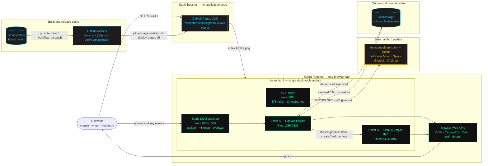

> **Note on D3.js:** earlier revisions loaded `d3.min.js` as a render-blocking `<script>` in
> `<head>` while never referencing a single D3 symbol. The tag has been **removed**; connectors,
> the particle field and the minimap were always hand-written. A CI job in `ci/verify.yml` now
> fails the build if any `<script src=…>` reappears, so the zero-dependency property is executable
> rather than aspirational.

---

## 2. Repository and module dependency map

**What it shows:** every file in the repository and the direction of dependency between them.
Because there is no module system, the two script blocks are coupled through the **global lexical
scope**, not through imports — the arrows labelled *global scope* are the real coupling.

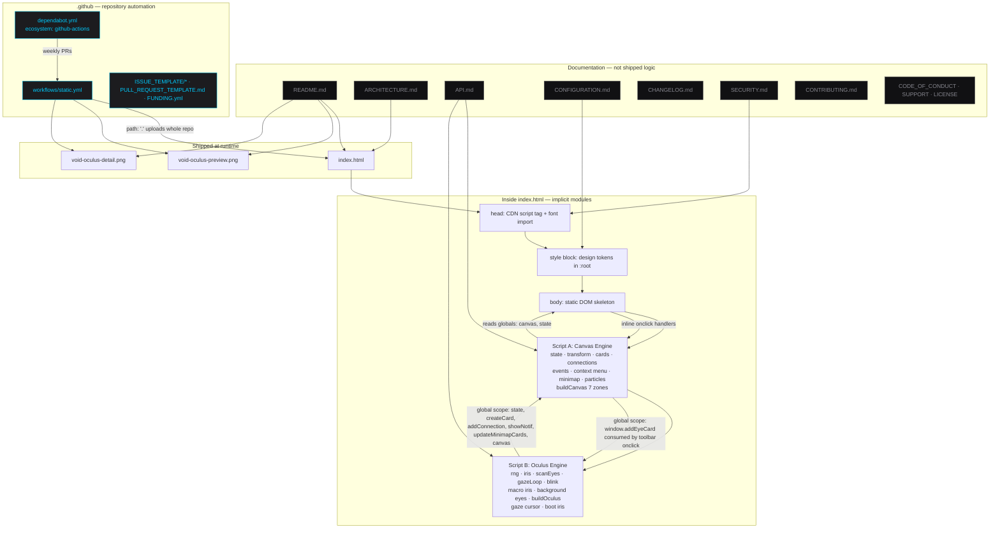

**Dependency boundary rules observable in the code**

| Boundary | Enforcement | Strength |
|---|---|---|
| Script B → Script A | none — plain global reads (`state`, `createCard`, `canvas`) | very weak, load-order dependent |
| Script A → Script B | one named contract: `window.addEyeCard` | weak, but explicit |
| DOM → Script A | inline `onclick="setTool('select')"` etc. in markup | hard-coded, requires globals to stay global |
| CSS → JS | shared `:root` custom properties and class names (`.blink`, `.dragging`, `.selected-card`) | convention only |

---

## 3. Frontend component hierarchy

**What it shows:** the actual DOM tree created by `index.html` plus the nodes injected at runtime,
grouped by stacking context. `z-index` values are read directly from the stylesheet.

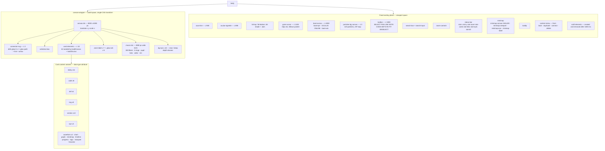

**Observation:** `README.md` documents four card types (`sticky`, `code`, `def`, `eye`). The code
actually emits **15 distinct `data-type` values**; the minimap colour table
(`updateMinimap`) knows about only 9 of them and falls back to `#555` for the rest.

---

## 4. Service interaction — there is no backend

**What it shows:** the complete inventory of network interactions. This diagram exists precisely to
make the *absence* of a backend explicit and auditable: the only cross-origin traffic is a font
stylesheet and its binaries — `GET`, unauthenticated, and non-blocking for application logic.

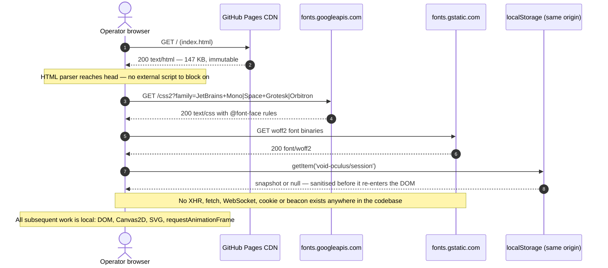

**Failure semantics of each dependency** — see §16.

---

## 5. Data-flow diagram

**What it shows:** how a raw input event becomes pixels. Note the two competing stores: the `state`
object and the DOM (`element.style.left/top`). Several functions read positions back **out of the
DOM** (`getCardCenter`, `gazeLoop`) rather than out of `state` — this is the single most important
data-flow characteristic of the system.

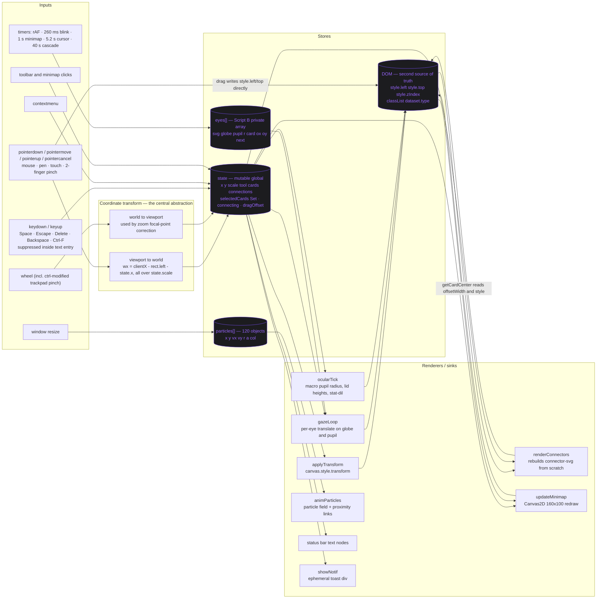

**Consequences of the dual store**

* `state.cards[i].x/y` is updated during drag, but `getCardCenter()` still parses `style.left`,
  so `state.cards` is effectively a **cache used only by the minimap**.
* `state.cards` entries carry `w`/`h` that are `0` until `updateMinimapCards()` measures them
  (100 ms after creation, and again 300–400 ms after boot).
* Cards created by `ctxAction('duplicate')` clone `innerHTML`, which **also clones any iris SVG**;
  the clone is *not* passed to `scanEyes`, so duplicated eyes never track the cursor — a real,
  observable bug that falls straight out of this diagram.

---

## 6. Request lifecycle — page load to interactive

**What it shows:** the boot sequence, in file order, with the timers that fire after it. This is the
"request lifecycle" for a system whose only request is `GET /`.

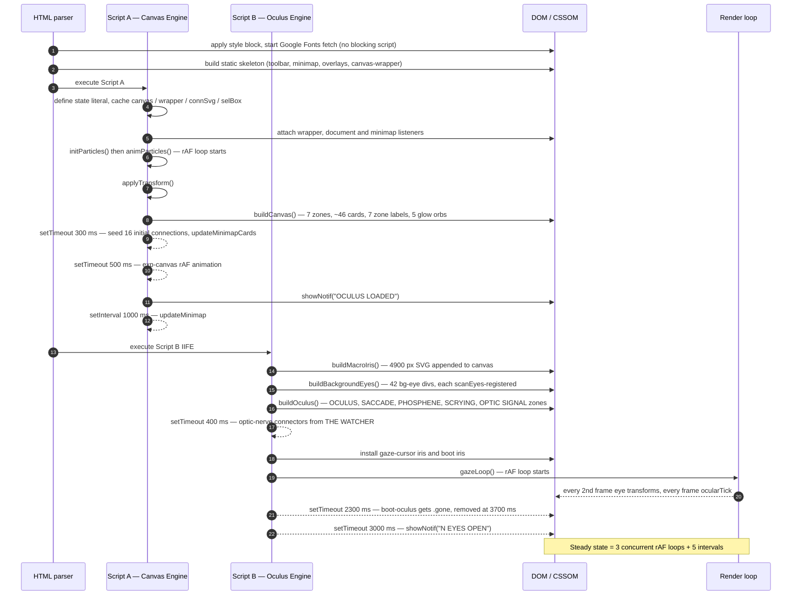

**Steady-state execution budget (read from the source, not measured)**

| Loop | Rate | Work per tick |
|---|---|---|
| `animParticles` | every frame | 120 particle integrations + **7 140 pair distance checks** (O(n²)) |
| `gazeLoop` | every frame; eye math every 2nd frame | up to ~50 eyes, viewport-culled at ±400 world px |
| `ocularTick` | every frame (called from `gazeLoop`) | 4 SVG attribute writes + 2 style writes + 1 text write |
| `drawExp` | every frame | 5 arcs on a 200×160 canvas |
| blink scan | 260 ms | linear scan of `eyes[]` |
| `updateMinimap` | 1000 ms, plus every transform/drag-end | full 160×100 redraw, iterates all cards and connections, **`getElementById` per card** |
| cursor blink | 5200 ms | class toggle |
| cascade blink | 40000 ms | schedules one `setTimeout` per eye + a notification |

---

## 7. Authentication and authorization

**What it shows:** the application has **no authentication or authorization whatsoever** — no
accounts, cookies, tokens or `connect-src` traffic. It does have one *data* trust boundary: the
origin-local session snapshot, which is treated as untrusted input on the way back in. The only
authorization boundary in the repository is the **GitHub Actions OIDC exchange** that lets CI
publish to Pages.

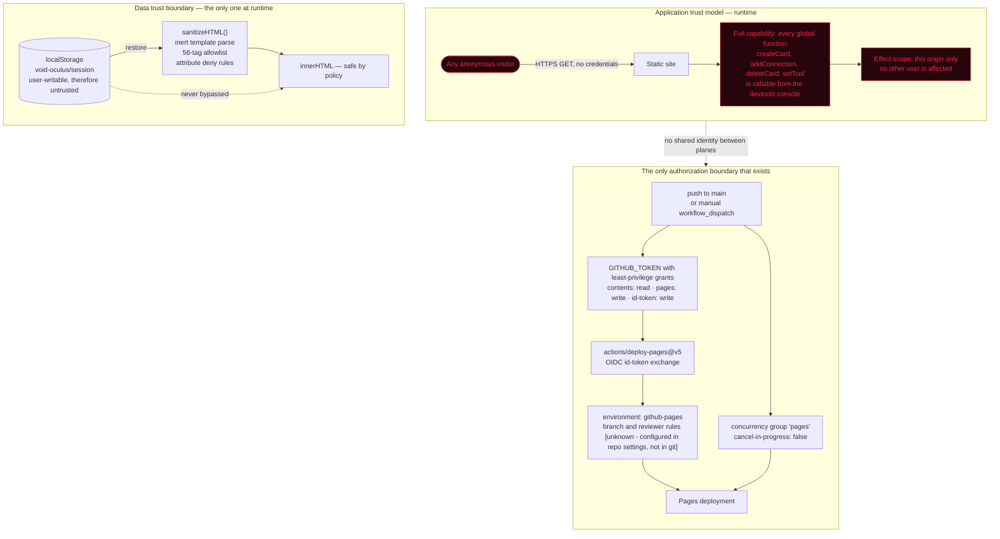

> **Explicitly absent (verified by grep):** `sessionStorage`, `document.cookie`, `fetch`,
> `XMLHttpRequest`, `WebSocket`, `navigator.credentials`, `crypto.subtle`.
> `localStorage` is present and deliberate: one key, same origin, never transmitted, and every byte
> read back passes `sanitizeHTML()` before touching the DOM. The dashed edge above is the invariant
> a reviewer should check on any new code path. Any multi-user feature would still need an entirely
> new tier — see §17.

---

## 8. Persistence model — ephemeral, in-memory

**What it shows:** the entity model that *would* be a schema if anything were persisted. These are
JavaScript object shapes living in the heap for the lifetime of one page view. There is **no
database, no IndexedDB, no file export**; a refresh destroys everything and `buildCanvas()` /
`buildOculus()` regenerate a deterministic seeded board.

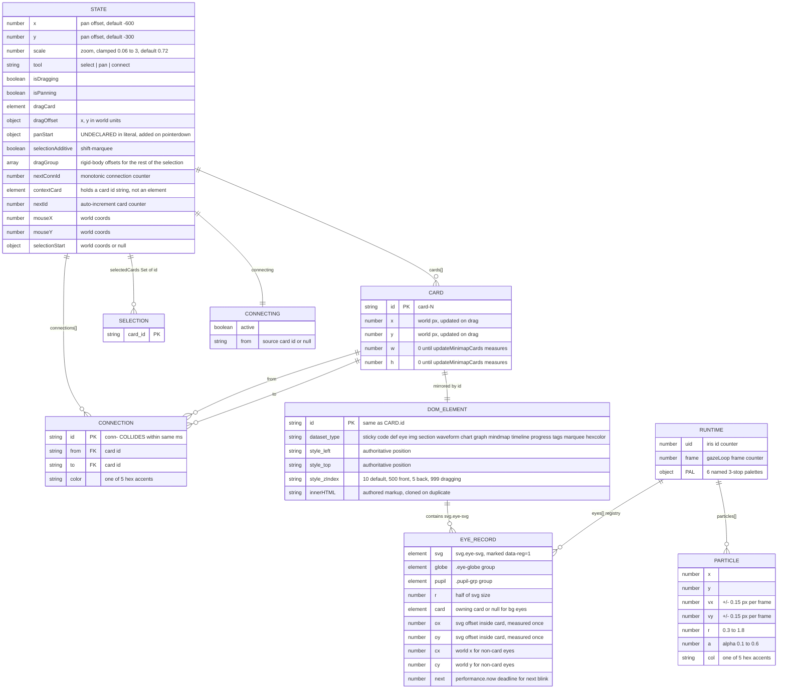

**Persistence gaps worth flagging**

* `conn-' + Date.now()` is not unique — the boot sequence adds 16 connections inside one
  `setTimeout`, so several share an id. Nothing currently reads `connection.id`, so the defect is
  latent rather than active.
* `deleteCard` cleans `state.cards`, `state.connections` and `selectedCards`, but **not**
  `eyes[]` — a deleted eye card leaves a dangling record whose `e.card` is detached from the
  document, so it keeps being iterated by `gazeLoop` forever (slow leak).

---

## 9. Internal API interaction map

**What it shows:** the global JavaScript surface documented in `API.md`, as a class-style map of
"who calls whom". This is the closest thing the project has to an API contract; everything on the
left is reachable from the console and from inline `onclick` attributes.

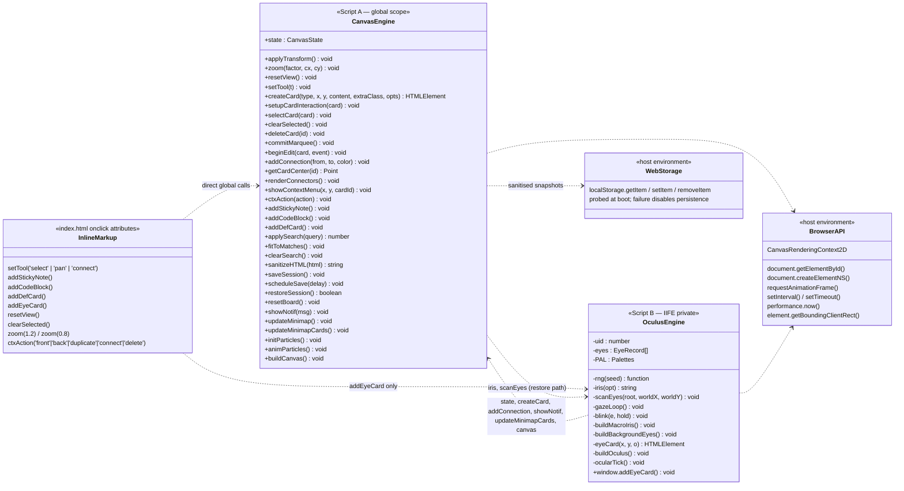

> **Cross-engine contract.** The two engines share exactly one mutable object, `window.VO`
> (`restored`, `pendingEyes`, `reducedMotion`, `storage`, `booting`), plus three exported symbols
> from the ocular engine: `addEyeCard` for the toolbar, and `iris` / `scanEyes` so the canvas engine
> can rehydrate restored irises from their seeds and adopt the resulting subtrees into gaze
> tracking. Everything else in Script B stays private to its IIFE.

**Dead or unwired surface found while mapping the API** — and its current status

| Element | Original finding | Status |
|---|---|---|
| `#search-input` | no listener anywhere in the file | **resolved** — debounced filter, hit/dim states, counter, `Enter` to frame, `Ctrl`/`Cmd`-`F` |
| `.sticky` body text "double-click to edit..." | no `dblclick` handler existed | **resolved** — `beginEdit()` over 14 scoped selectors |
| `d3.min.js` | zero call sites | **resolved** — tag removed; CI fails the build if any external script returns |
| `extraClass` param of `createCard` | accepted, never applied | **resolved** — applied to the card root |
| 5 `<filter>` defs in `renderConnectors` | rebuilt per call, referenced by nothing | **resolved** — removed |
| `#tooltip` | element exists, never populated or shown | **open** — still dead UI |
| `targets` const in `buildOculus` optic-nerve block | assigned, never read | **open** — dead local |

---

## 10. Deployment and infrastructure topology

**What it shows:** everything between a commit and a rendered pixel. There is exactly one
environment; there is no staging, no CDN of our own, no runtime configuration.

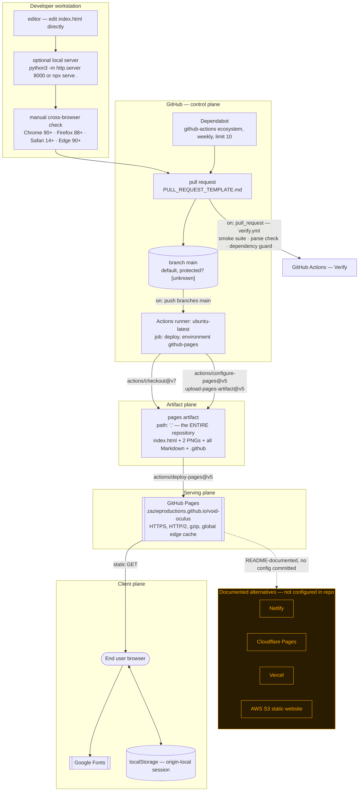

**Operational assumptions baked into this topology**

1. Deployment is **whole-repository publication** — `path: '.'` means `README.md`,
   `SECURITY.md`, `.github/workflows/static.yml` and both 1.4 MB PNGs are all publicly fetchable at
   the site origin. Nothing secret exists in the repo today, so this is a hygiene issue, not a leak.
2. Payload per cold visit ≈ **147 KB HTML** plus fonts. The previously bundled ~280 KB unused D3
   download is gone. The two PNGs (3 MB combined) are only fetched by people reading the README on
   GitHub.
3. No cache-busting strategy exists; Pages serves `index.html` with short-lived caching by default
   **[inferred — not configured in the repo]**.
4. Rollback = revert the commit and let the workflow re-run. There is no artifact retention policy
   or environment promotion.

---

## 11. Build, test, and release pipeline

**What it shows:** the real CI graph. There is no build, no lint, no test and no version gate — the
only job is `deploy`. Everything drawn dashed is a *documented human step*, not automation.

```mermaid
flowchart LR
  subgraph Local["Local — manual, per CONTRIBUTING.md"]
    L1["edit index.html"]
    L2["open in 4 browsers"]
    L3["commit: 'Add: description'"]
    L1 -.-> L2 -.-> L3
  end

  subgraph Review["GitHub review"]
    R1["PR from feature/* fork branch"]
    R2["human review<br/>no required status checks [unknown]"]
    R3["merge to main"]
    R1 --> R2 --> R3
  end

  subgraph Pipeline["Actions — static.yml, single job 'deploy'"]
    direction TB
    T0{"trigger:<br/>push to main OR workflow_dispatch"}
    C1["concurrency group 'pages'<br/>queued runs skipped, in-progress never cancelled"]
    S1["actions/checkout@v7"]
    S2["actions/configure-pages@v5"]
    S3["actions/upload-pages-artifact@v5<br/>path: '.'"]
    S4["actions/deploy-pages@v5<br/>outputs page_url"]
    T0 --> C1 --> S1 --> S2 --> S3 --> S4
  end

  subgraph Missing["Absent stages — proposed, not present"]
    M1["HTML / CSS / JS lint"]
    M2["unit or DOM tests"]
    M3["Lighthouse or perf budget"]
    M4["SRI hash generation"]
    M5["semver tag + GitHub Release"]
  end

  L3 --> R1
  R3 --> T0
  S4 --> DONE(["live at page_url"])
  Pipeline -.->|"gap"| Missing

  classDef gap fill:#26060c,stroke:#cc2233,color:#ff2244,stroke-dasharray: 4 3
  class Missing,M1,M2,M3,M4,M5 gap
```

### 11.1 Branch and release history model

**What it shows:** the branching pattern actually observable in the repository — a linear `main`
receiving Dependabot merge commits (HEAD is *"Merge pull request #3 from
zazieproductions/dependabot/github_actions/actions/upload-pages-artifact-5"*), plus the
`feature/*` convention that `CONTRIBUTING.md` prescribes. Versioning is `Keep a Changelog` +
SemVer per `CHANGELOG.md`, but **no git tags exist yet**.

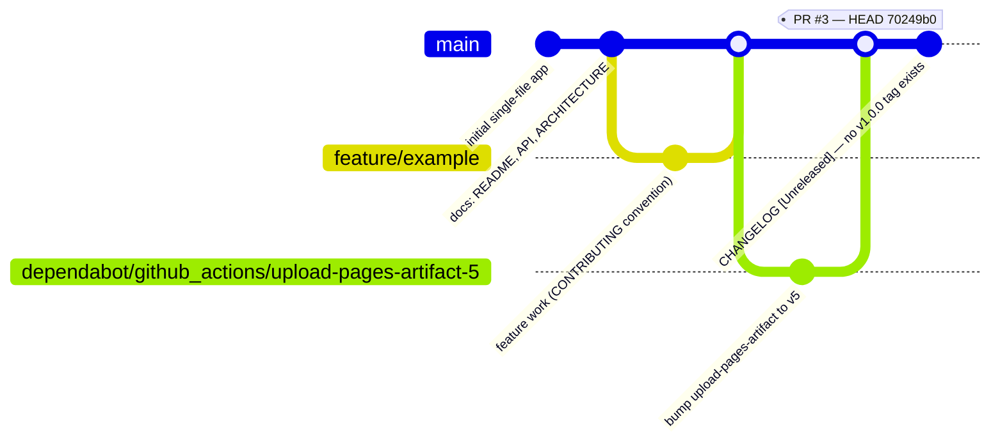

---

## 12. Primary user workflow

**What it shows:** the end-to-end journey from cold load to a linked knowledge graph, and where the
journey terminates because a capability does not exist.

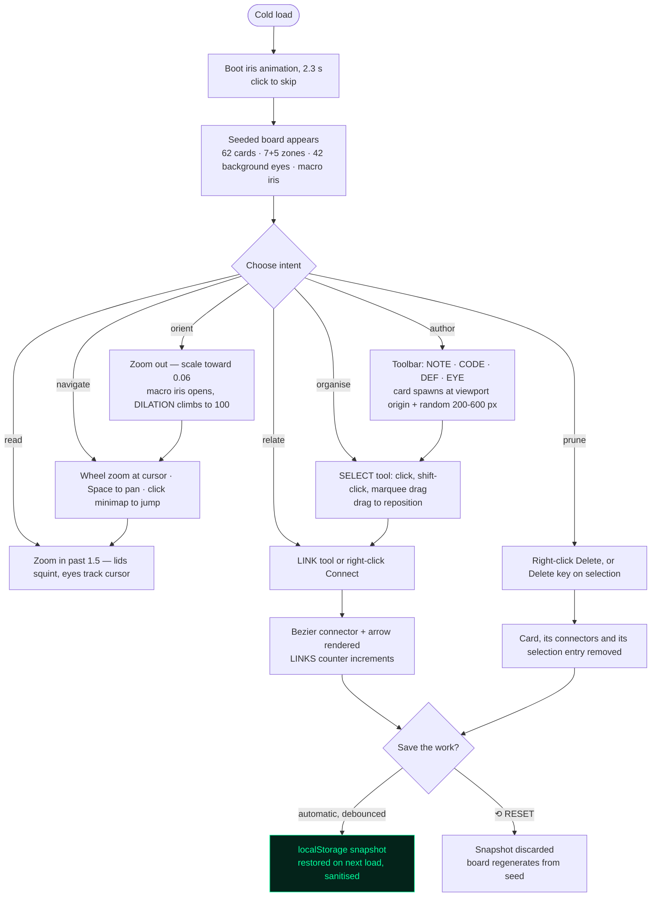

> The authoring loop is now both *spatial* (place, move, marquee, link, delete) and *textual*
> (double-click to edit, search to find). Work survives a refresh; discarding it is an explicit act.

---

## 13. State management

**What it shows:** the interaction state machine implied by `state.tool`, `state.isDragging`,
`state.isPanning`, `state.selectionStart` and `state.connecting`. Transitions are labelled with the
handler that performs them.

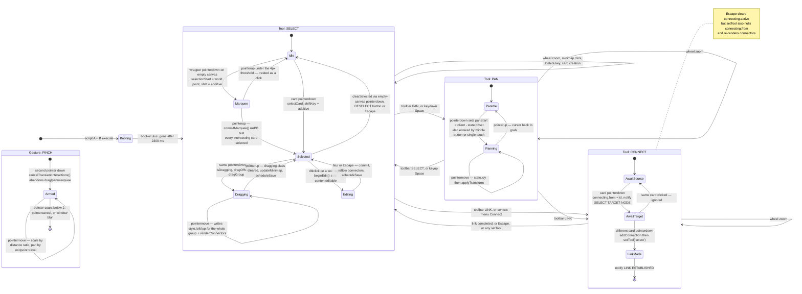

**State-management assessment**

* Single mutable global object, no reducer, no immutability, no change notification — every mutation
  site is also responsible for calling the right renderer. Missing that call is the most likely class
  of future bug (e.g. `deleteCard` correctly calls `renderConnectors()`; `ctxAction('front'/'back')`
  correctly needs none).
* The middle-mouse button (`e.button === 1`) enters panning **without changing `state.tool`**, so the
  cursor reset on `mouseup` reads the stale tool — a small state-versus-presentation divergence.
* `state.panStart` is created ad hoc and is absent from both the literal and the JSDoc typedef.

---

## 14. Sequence — the most important end-to-end operation: creating a link

**What it shows:** the full call chain for "connect two cards", the operation that turns the canvas
from a pile of cards into a knowledge graph. It exercises the tool state machine, both stores, the
SVG renderer, the minimap and the notification system.

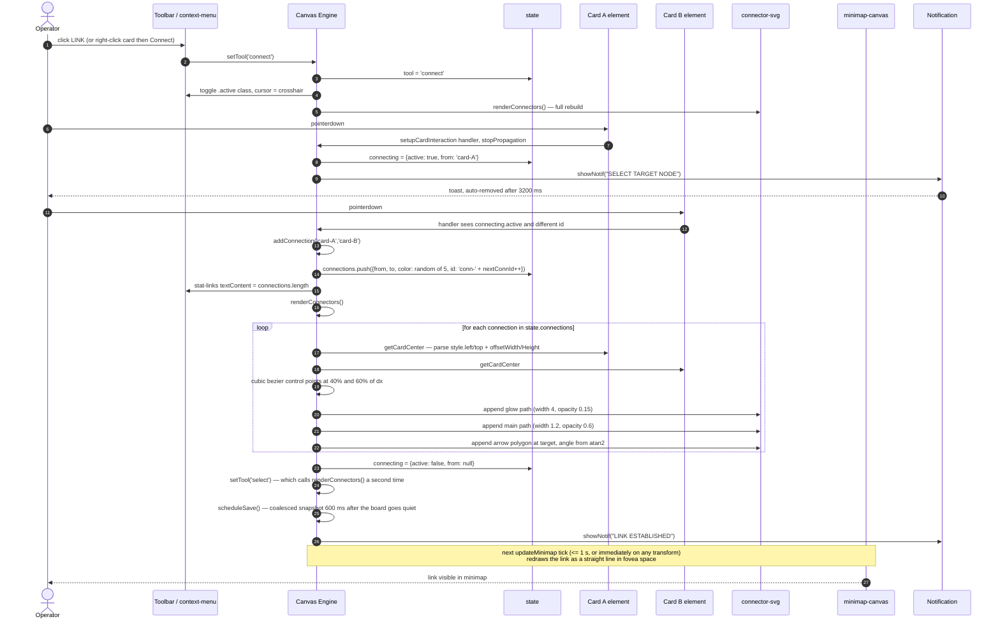

**What this sequence exposes**

* `renderConnectors()` is **O(connections)** but rebuilds the *entire* SVG subtree on every call,
  and it is called on **every `pointermove` during a card drag**. With ~30 connections this is fine;
  it is still the first thing that will break at scale.
* The five unreferenced `<filter>` defs that used to be re-created on every call have been
  **removed**. Bloom was always drawn as a wide translucent underlay stroke; the filters were pure
  overhead, and an offscreen blur pass per path would have been an order of magnitude worse at drag
  frame rates.
* Two `renderConnectors()` calls happen back to back (once from `addConnection`, once from
  `setTool('select')`).
* Connection ids come from a monotonic counter rather than `Date.now()`, which could collide for
  links created inside the same millisecond — reachable via the seeded board's bulk linking.

---

## 15. Security boundaries and trust zones

**What it shows:** where code and data cross a trust boundary. For a client-only static site the
interesting boundaries are *supply chain* (CDN), *authoring* (innerHTML), and *publication* (CI).

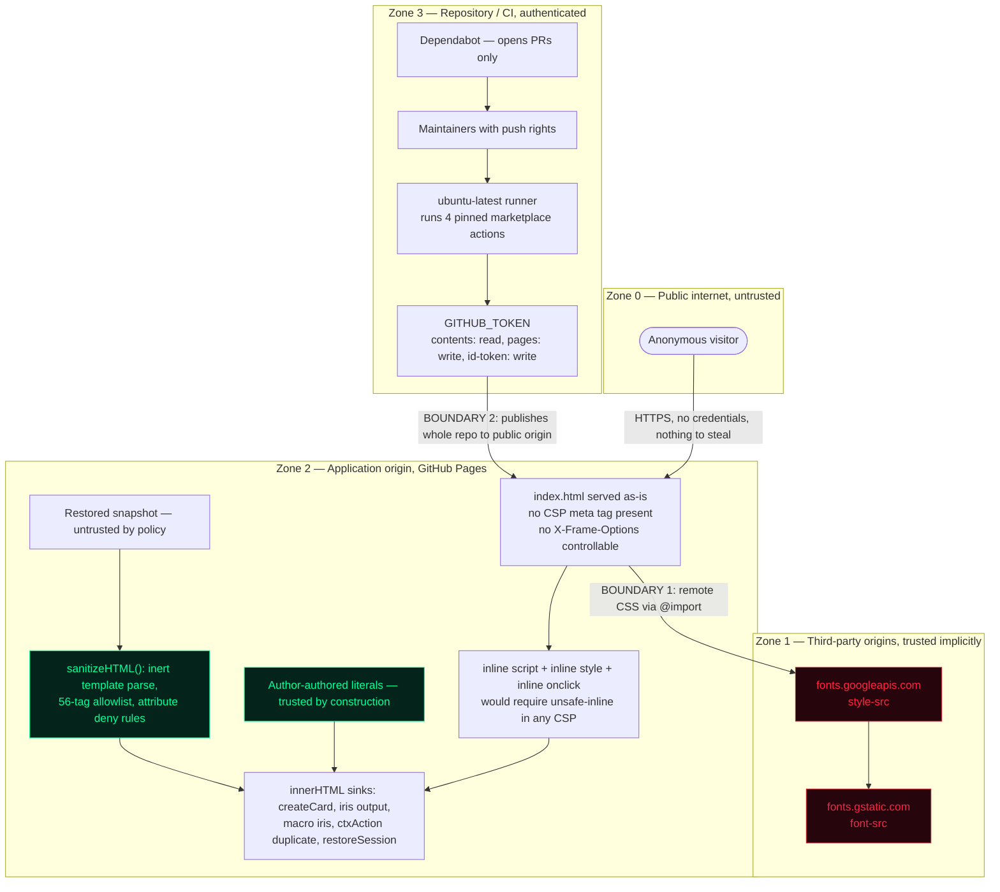

**Boundary-by-boundary finding**

| # | Boundary | Current control | Residual risk |
|---|---|---|---|
| 1 | `cdnjs` → page | **eliminated** — the unused D3 tag is gone and a CI job fails the build if any `<script src=…>` returns | None. The gratuitous remote-code trust relationship no longer exists. |
| 2 | Google Fonts `@import` | none | Style-injection and a privacy/GDPR-relevant third-party request. Low severity; vendoring the three families removes it entirely. |
| 3 | CI → public origin | least-privilege `GITHUB_TOKEN`, OIDC deploy, pinned major-version actions, Dependabot upkeep | Good. Weakness: `path: '.'` publishes everything in the repo by default. |
| 4 | `innerHTML` usage | `sanitizeHTML()` on the restore path; author literals elsewhere | Controlled. The standing invariant is that *every* future inbound path — import, paste, drag-and-drop, URL fragment — routes through the sanitiser. Nine assertions in `tests/smoke.mjs` pin the policy, including that sanitisation itself executes nothing. |
| 5 | Client data at rest | one `localStorage` key, same origin, never transmitted, erasable via `⟲ RESET` | Low. The data is the user's own board; the risk it introduces is the untrusted-input path in row 4, which is now mitigated. |

---

## 16. Failure handling, fallback and recovery

**What it shows:** what actually happens when each dependency or invariant fails. Solid arrows are
behaviours present in the code; dashed red boxes are unhandled paths.

```mermaid
flowchart TB
  subgraph Ext["External failure modes"]
    F2{"Google Fonts unreachable"}
    F3{"Pages deploy fails"}
    F11{"localStorage blocked<br/>or over quota"}
    F12{"Stored snapshot corrupt<br/>or from an unknown schema"}
  end

  subgraph Int["Internal failure modes — guards found in code"]
    F4{"getCardCenter target missing"}
    F5{"scanEyes finds no .eye-globe"}
    F6{"stat-* element missing"}
    F7{"exp-canvas missing"}
    F8{"eyes[] entry card detached after delete"}
    F9{"O(n^2) particle loop at high n"}
    F10{"renderConnectors called every drag frame"}
  end

  F2 --> R2["CSS @import fails silently<br/>font-family falls back to monospace / sans-serif"]
  R2 --> OK2["Degrades gracefully"]

  F3 --> R3["concurrency 'pages' keeps last good deploy live<br/>cancel-in-progress: false"]
  R3 --> OK3["Recovery = revert commit and re-run workflow"]

  F4 --> G4["returns null; renderConnectors and updateMinimap<br/>skip that connection via early return"]
  G4 --> OK4["Handled — stale links are simply not drawn"]

  F5 --> G5["early return before pushing to eyes[]"]
  G5 --> OK5["Handled"]

  F6 --> G6["optional chaining / if(st) guards<br/>in scanEyes and ocularTick"]
  G6 --> OK6["Handled"]

  F7 --> G7["if (ec) guard before getContext"]
  G7 --> OK7["Handled"]

  F8 --> G8["pruneDetachedEyes() in the gaze loop<br/>drops records whose card is !isConnected, ~every 2 s"]
  G8 --> OK8["Handled — registry and EYES counter both settle"]

  F11 --> G11["localStorage probed at boot (VO.storage)<br/>write failure disables persistence and notifies once"]
  G11 --> OK11["Handled — board stays fully usable in memory"]

  F12 --> G12["schema-version check, then all-or-nothing restore<br/>partial board torn down, snapshot dropped"]
  G12 --> OK12["Handled — falls back to the deterministic seeded board"]

  F9 -.->|"fixed 120 particles, no adaptive cap"| X9["7140 distance checks per frame,<br/>independent of device class<br/>(loop halts entirely under reduced motion)"]
  F10 -.->|"no rAF batching or debounce"| X10["Full SVG subtree rebuild per pointermove"]

  classDef bad fill:#26060c,stroke:#cc2233,color:#ff2244,stroke-dasharray: 4 3
  classDef good fill:#04231a,stroke:#00ff9d,color:#00ff9d
  class X9,X10 bad
  class OK2,OK3,OK4,OK5,OK6,OK7,OK8,OK11,OK12 good
```

> **Error boundaries are still narrow.** `try/catch` now guards the three places where failure is
> expected rather than exceptional — the storage probe, snapshot serialisation, and session restore
> — and each has a defined fallback. There is still no `window.onerror` and no telemetry: an
> exception thrown inside `gazeLoop` would silently kill the rAF chain and freeze every eye and the
> macro-iris dilation while the rest of the UI keeps working. That partial-failure mode remains
> invisible to both user and maintainer.

---

## 17. Architecture narrative

### 17.1 Major layers and their responsibilities

| Layer | Location | Responsibility | Depends on |
|---|---|---|---|
| **Design-token layer** | `:root` in the style block | Single source of colour, typography, elevation. Referenced by both CSS rules and JS (`var(--phosphor)` inside generated markup). | nothing |
| **Presentation layer** | ~190 CSS rules, 13 `@keyframes`, responsive + reduced-motion blocks | All static appearance and all ambient animation (scan line, marquee, shimmer, iris breathing, boot open). Deliberately keeps animation *off* the JS thread, and stops it entirely when the OS asks. | tokens |
| **Document skeleton** | body markup, lines 1060–1149 | Declares the fixed chrome (toolbar, status bar, minimap, context menu, overlays) and the world container. Binds UI to logic via inline `onclick`. | Canvas Engine globals |
| **Canvas Engine (Script A)** | lines 1149–3054 | The application core: state, coordinate transform, card CRUD, connection model, pointer/keyboard/wheel handling, marquee, in-place editing, search, context menu, minimap, particle field, session persistence and sanitisation, and the seeded board (`buildCanvas`, 7 zones). | DOM, Web APIs, Web Storage |
| **Oculus Engine (Script B)** | lines 3055–3977 | The identity of the product: deterministic procedural iris generation, the gaze registry, tracking loop and detached-record pruning, blink scheduling, the 4900 px macro iris, 42 ambient watchers, 5 further content zones, gaze cursor, boot iris, and iris rehydration for restored boards. | *reaches into* Canvas Engine globals via `VO` |
| **Test layer** | `tests/smoke.mjs` | 54 jsdom assertions over construction, search, marquee, group drag, editing, registry hygiene, sanitisation and persistence. Test-only dependency, installed on demand. | jsdom |
| **Hosting/CI layer** | `.github/workflows/static.yml`, `ci/verify.yml` | Copies the repo to Pages, with no transformation; verification runs the suite, parses both inline scripts, and guards the zero-dependency invariant. | GitHub |

### 17.2 Primary control and data flows

Control is **entirely event-driven from the browser**, with three long-lived rAF loops as the only
autonomous actors (`animParticles`, `gazeLoop`→`ocularTick`, `drawExp`) plus five intervals. Data
flows in one direction per interaction — *input → world-space transform → mutate `state` and/or DOM
→ call the specific renderer(s) affected* — but there is no framework enforcing that ordering, so
correctness rests on discipline at each call site. The reverse flow (renderers reading positions
back out of the DOM via `getCardCenter` and `gazeLoop`) is what makes the DOM, not `state`, the
authoritative store for geometry.

### 17.3 The most important abstractions

1. **The world/viewport transform.** Three lines of arithmetic
   (`w = (client - rect - state.pan) / state.scale`) repeated at seven call sites. It is the load-bearing
   abstraction of the whole app and it is *not* factored into a function — see technical debt.
2. **`createCard(type, x, y, content, extraClass, opts)`.** The single constructor for all 15 card
   variants; type is a `data-attribute`, content is an HTML string. Extremely cheap to add a card
   variant, impossible to add card *behaviour* without special-casing. `opts` exists solely so the
   restore path can reuse persisted ids and layers without a second constructor.
3. **`iris(opt)`.** A pure, deterministic, seeded SVG-string generator. Given `{size, pal, seed,
   pupil, fibers, veins, drift}` it returns self-contained markup with namespaced gradient ids
   (`ocuN-i`, `ocuN-p`, `ocuN-s`, `ocuN-c`). Every eye in the product — card eyes, 42 background
   watchers, the cursor, the boot screen — comes out of this one function. This is the cleanest
   abstraction in the repository.
4. **The `eyes[]` gaze registry.** Decouples *how eyes are created* from *how they are animated*:
   `scanEyes(root)` finds any unregistered `svg.eye-svg`, marks it `data-reg=1`, measures its offset
   inside its owning card once, and hands it to a single shared loop. Idempotent by construction,
   and self-cleaning — `pruneDetachedEyes()` drops records whose card has left the document.
6. **`sanitizeHTML(html)`.** The single gate between stored bytes and the DOM. Like `iris()` it is
   pure input→string, and it is the reason persistence could be added without widening the XSS
   surface.
5. **`state.scale` as a UX signal.** Zoom is not merely a viewport property; `ocularTick` maps it to
   macro-pupil radius, eyelid height and the DILATION readout. Navigation *is* the narrative.

### 17.4 Coupling and dependency boundaries

* **Strongest coupling:** Script B → Script A via bare globals. Script B cannot be extracted,
  deferred, `type="module"`-ified, or unit-tested without breaking, because it assumes Script A has
  already executed in the same global lexical scope.
* **Second-strongest:** markup → globals via inline `onclick`. Any minifier that renames top-level
  functions, or any move to modules (which are scoped), breaks the toolbar silently.
* **Cleanest boundary:** `iris()` — pure input→string, zero DOM or state access.
* **Accidental boundary:** the DOM is used as an IPC channel between subsystems (`scanEyes` locates
  eyes by CSS selector; `getCardCenter` reads inline styles; `updateMinimap` calls `getElementById`
  per card per tick).

### 17.5 External integrations

One, an unauthenticated GET: **Google Fonts** (three families via `@import`). The unused cdnjs D3
script has been removed and CI now fails on any `<script src=…>`. No analytics, no telemetry, no
error reporting, no APIs. The only durable state is a same-origin `localStorage` key.

### 17.6 Operational assumptions

* Single user, single tab, modern evergreen browser. Input is now Pointer Events throughout, so
  mouse, pen and touch share one path; two-finger pinch and single-finger pan make the canvas usable
  on tablets, which the responsive CSS previously promised without delivering.
* Board content ships **in source** (`buildCanvas`/`buildOculus`) as a seeded starting point, but is
  now genuinely user-editable: create, move, marquee, link, edit text, delete — all persisted.
* Origin-scoped by design: the session lives in `localStorage`, and `⟲ RESET` is the reset button.
  Two tabs on the same origin will overwrite each other's snapshots.
* Deployment is instantaneous and atomic; no migrations, no config, no secrets. Snapshot schema
  changes are handled by bumping `SCHEMA_VERSION`, which discards rather than migrates.

### 17.7 Likely scalability constraints

| Constraint | Mechanism | Ceiling **[inferred]** |
|---|---|---|
| Connector re-render on every drag frame | full SVG teardown + rebuild, `getElementById` ×2 per link | degrades noticeably in the low hundreds of links |
| Particle proximity graph | O(n²) — 120 particles = 7 140 checks/frame, hard-coded | fixed cost; the constant, not the growth, is the problem on low-end GPUs |
| Minimap refresh | full redraw + `getElementById` per card, 1 Hz plus every transform | linear in card count; fine at 62, wasteful at 1 000 |
| Gaze loop | viewport-culled at ±400 world px, half-rate, with a 2 s prune pass — the best-optimised loop | scales well; no longer leaks on deleted eyes |
| DOM card count | every card is a live DOM subtree with SVG children; no virtualisation or occlusion culling | thousands of cards will exhaust layout, not JS |
| Single-file delivery | 147 KB uncompressed HTML, no code splitting | fine today; every new zone grows the critical path |
| Session snapshot | one synchronous `JSON.stringify` per quiet period; irises stored as seeds | ~100 KB at 85 cards, so comfortably inside the 5 MB origin quota; a board an order of magnitude larger would want IndexedDB |
| Concurrency | none — one user, no shared state | **N/A** |

### 17.8 Notable architectural strengths

* **Radical deployability.** One file, no build, no lockfile, no toolchain rot. It will still open in
  a browser in ten years. `path: '.'` → Pages is about as simple as a release pipeline can be.
* **Genuine separation of animation concerns.** Ambient motion is CSS keyframes; only *reactive*
  motion (gaze, dilation, particles) is on the JS thread.
* **Deterministic procedural content.** `rng(seed)` + `iris(opt)` means the board is byte-identical
  across loads and across machines — trivially reproducible for screenshots and bug reports.
* **Correct zoom-at-cursor maths**, with a clamped scale range and focal-point correction.
* **Sensible defensive guards** in exactly the places where the DOM might not be ready
  (`if (!el) return`, `?.`, `if (ec)`).
* **Above-average repository hygiene for a single-file toy:** CHANGELOG, CONTRIBUTING, SECURITY,
  CODE_OF_CONDUCT, SUPPORT, issue/PR templates, Dependabot, JSDoc typedefs on the core state.
* **Least-privilege CI** with explicit `permissions:` and OIDC deployment.

### 17.9 Technical debt and ambiguity

**Resolved since this review was written**

| # | Finding | Resolution |
|---|---|---|
| 1 | `deleteCard()` never pruned `eyes[]` → dangling records animated forever | `pruneDetachedEyes()` runs in the gaze loop every ~2 s, keyed on `isConnected`; asserted in the suite |
| 2 | `ctxAction('duplicate')` produced inert eyes | The clone's stale `data-reg` is cleared and `scanEyes()` re-adopts it. **The duplicated gradient-id collision remains open** — see below |
| 3 | Marquee drawn but never hit-tested | `commitMarquee()` performs an AABB test on `pointerup`; Shift is additive, sub-4px is a click |
| 4 | `'conn-' + Date.now()` ids collide within a millisecond | Monotonic `state.nextConnId` counter |
| 5 | `extraClass` accepted and silently discarded | Applied to the card root |
| 7 | Unreferenced `filter id="glow-N"` defs rebuilt every render | Removed |
| 13 | Unused, un-integrity-checked, render-blocking `d3.min.js` | Tag deleted; a CI job fails the build if any external script returns |

**Correctness — still open**

1. Duplicating a card that contains an iris copies its SVG gradient **ids**, producing document-wide
   id collisions. Harmless today because each gradient is visually identical, but it is a latent
   rendering bug the moment two eyes with the same id differ.
2. Middle-click panning bypasses `state.tool`, leaving the cursor state inconsistent on release.
3. `state.panStart` is created ad hoc, absent from both the state literal and the JSDoc typedef.

**Structure**

4. The viewport→world transform is duplicated at several call sites instead of being one function.
5. Two sources of truth for geometry (`state.cards[].x/y` vs `style.left/top`), with the DOM winning.
6. Cross-script coupling through globals. Now *documented* rather than implicit — `VO` plus three
   named exports — but Script B still cannot be loaded independently.
7. `buildCanvas()` is a ~560-line literal-markup function; `buildOculus()` is ~460. Content and
   engine are interleaved, so adding content means editing the engine file.
8. `try/catch` covers the storage paths only; there is still no `window.onerror`, so a throw inside
   a rAF loop dies silently.

**Supply chain**

9. `SECURITY.md` documents a CSP that is not applied to `index.html`; the fonts are still remote.

**Documentation drift (found while writing this file)** — every row has since been corrected in the
document named, and the underlying code claim is now true or the claim was removed.

| Claim | Where | Reality at the time |
|---|---|---|
| "D3.js force simulation for ambient particles" | README, old ARCHITECTURE | Hand-written integrator in `animParticles()`; D3 never called |
| "D3.js-rendered bezier paths" / "`d3.line()` cardinal interpolation" | README | Manual `createElementNS` + string-built cubic bezier |
| "Cards use `will-change: transform`" | README, old ARCHITECTURE | `will-change` appears once, on `.eye-svg .eye-globe/.pupil-grp`, never on `.card` |
| "Connector redraws debounced on pan/zoom end" | README, old ARCHITECTURE | Re-rendered on **every** drag frame — still true, now documented as a known hot path |
| `state = { links: [], selected: [], pan: {x,y}, zoom: 1 }` | README | Actual keys are `connections`, `selectedCards` (a `Set`), `x`, `y`, `scale` |
| "Off-screen eyes skip render" | old ARCHITECTURE | True — the one performance claim that held |
| Four card types | README | 15 distinct `data-type` values are emitted |
| "Keyboard shortcuts are planned for a future release" | README | Space / Escape / Delete / Backspace were already implemented |
| `addStickyNote(x, y)` takes coordinates | API.md | Takes no parameters; position is viewport-origin + random offset |
| SVG `feGaussianBlur` glow | old ARCHITECTURE | Filters defined but unreferenced; glow is a wide translucent stroke |

**Ambiguity / unknowns**

* Branch protection, required checks and the `github-pages` environment's reviewer rules are
  configured in GitHub settings, not in the repository — **[unknown]** from source alone.
* Whether the alternative hosts in README (Netlify, Cloudflare, Vercel, S3) are actually in use —
  **[unknown]**; no configuration for any of them is committed.
* `CHANGELOG.md` claims a `1.0.0` release dated `2024-XX-XX`; there are no git tags and no release —
  the version line is **[inferred, unverified]**.
* `#tooltip` still exists with no logic — unfinished feature or intentional scaffolding
  — **[unknown]**. (`#search-input` is now wired.)

### 17.10 Proposed next architectural moves (not present in the repository)

**Done since this review was written** — 2 (D3 tag deleted, trust zone removed), 4 (`eyes[]` pruned
on detachment, duplicated cards re-scanned) and 6 (persistence, shaped exactly as the §8 entity
model predicted, with a sanitiser on the inbound edge).

**Still [proposed]**, listed so a new engineer knows the shape of change:

1. Extract the viewport↔world transform into `toWorld()` / `toScreen()` helpers — removes the
   duplications and makes the coordinate system testable in isolation.
2. Make `state` the single source of geometry; have renderers read `state.cards`, and write to the
   DOM only in `applyTransform`-style sinks. This is the prerequisite for everything below it.
3. Batch `renderConnectors()` behind `requestAnimationFrame`, then move to incremental updates keyed
   by card id — the change with the largest perceived-performance payoff.
4. Namespace generated SVG gradient ids per card instance so duplication cannot collide.
5. Promote card content from sanitised markup to a typed content tree, which is what would make
   charts and timelines editable as data and undo/redo tractable.
6. Split the seeded board (`buildCanvas` / `buildOculus`) out of the engines into a data module, so
   content can change without touching engine code.
