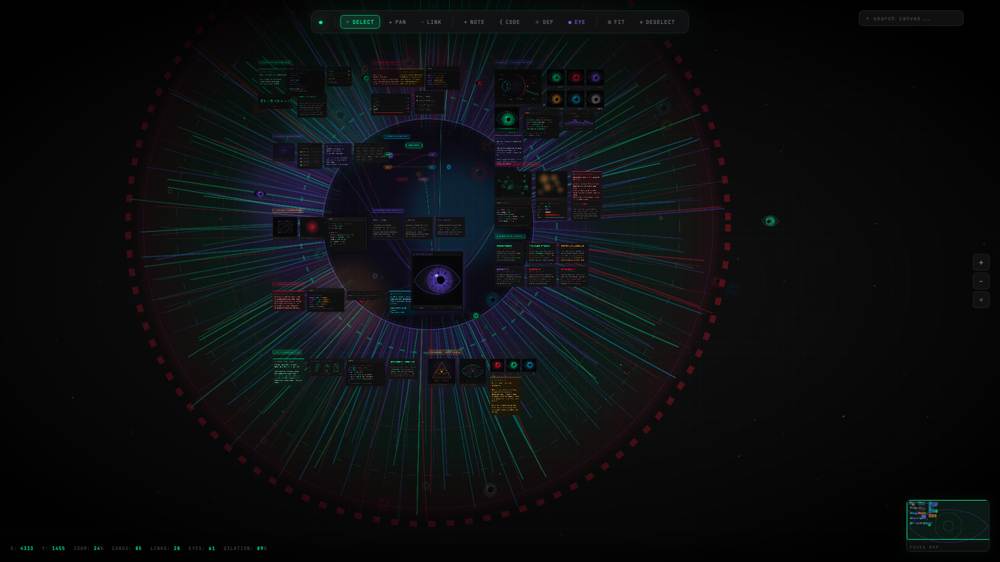
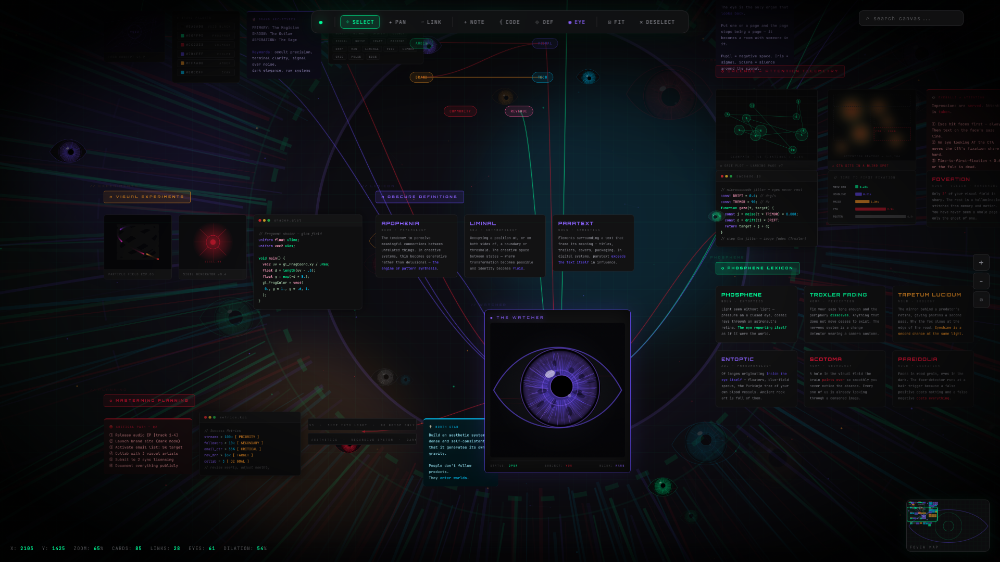

# VOID//OCULUS

> **The canvas is an eye.**

[](https://opensource.org/licenses/MIT)
[](https://developer.mozilla.org/en-US/docs/Web/JavaScript)
[](https://d3js.org/)
[](#deployment)

<p align="center">
  <a href="https://zazieproductions.github.io/void-oculus/">
    
  </a>
</p>

<p align="center">
  <a href="https://zazieproductions.github.io/void-oculus/">
    <strong>◉ ENTER THE OCULUS ◉</strong>
  </a>
</p>

---

## Overview

**VOID//OCULUS** is an experimental browser-based infinite canvas and visual knowledge management system. It combines the organizational power of networked thought with an immersive, reactive ocular interface that responds to user interaction through animated gaze tracking, particle fields, and real-time dilation effects.

The system supports spatial arrangement of heterogeneous content blocks—notes, code fragments, definitions, and custom "eye" nodes—connected through a visual link graph. It operates entirely client-side with no build step or server dependencies, loading from a single HTML file.

---

## Interface Detail

<p align="center">
  
</p>

---

## Features

### Canvas & Navigation
- **Infinite pan/zoom canvas** (8000×6000px virtual space) with smooth momentum-based panning
- **Multi-card selection** with Shift-click for additive selection
- **Minimap** for spatial orientation and quick navigation
- **Fit-to-view** reset for returning to origin

### Card Types
| Type | Purpose | Visual Style |
|------|---------|--------------|
| **Sticky Note** | Quick notes, annotations, task cards | Color-coded backgrounds (cyan, green, red, amber) |
| **Code Block** | Syntax-highlighted code snippets | Monospace font, header bar with dots, themed tokens |
| **Definition Card** | Term-definition pairs with metadata | Clean typography with term highlighting |
| **Eye Node** | Visual anchors, focal points, connections | Animated pupil with tracking behavior |

### Linking & Connections
- **Visual link graph** between any two cards via SVG bezier curves
- **Bidirectional connectors** rendered in the connector layer
- **Connection persistence** across pan/zoom transforms

### Visual Effects
- **Particle field** — animated background particles with varying opacity
- **Scan-line overlay** — subtle CRT-style horizontal scan lines
- **Boot animation** — ocular startup sequence on page load
- **Vignette** — edge darkening for depth
- **Eyelid animation** — reactive blink and aperture effects
- **Pupil dilation** — real-time eye dilation based on canvas activity

### User Interface
- **Floating toolbar** — tool selection and card creation
- **Search** — filter visible cards by text content
- **Zoom controls** — mouse wheel + UI buttons
- **Context menus** — right-click for card operations (duplicate, layer, connect, delete)
- **Status bar** — real-time display of position, zoom level, and entity counts

---

## Quick Start

### Option 1: Direct Browser Launch

Download or clone the repository, then open `index.html` in any modern browser (Chrome, Firefox, Safari, Edge).

### Option 2: Local HTTP Server

For consistent behavior across browsers (especially for clipboard and fullscreen APIs):

```bash
# Python 3
python3 -m http.server 8000

# Node.js (if npx available)
npx serve .
```

Then visit [http://localhost:8000](http://localhost:8000).

---

## Controls Reference

### Mouse

| Action | Input |
|--------|-------|
| Select card | Click |
| Drag card | Click + drag (when Select tool active) |
| Multi-select | Shift + click |
| Pan canvas | Click + drag (when Pan tool active) |
| Zoom | Mouse wheel |
| Connect cards | Click first card, then second (Link tool) |
| Context menu | Right-click on card |

### Keyboard

> **Note:** Keyboard shortcuts are planned for a future release. Currently, all interactions are mouse-driven.

### Toolbar Tools

| Tool | Icon | Function |
|------|------|----------|
| **SELECT** | ⊹ | Default selection and drag mode |
| **PAN** | ✦ | Canvas panning without card interaction |
| **LINK** | ⊸ | Connection creation between cards |
| **+NOTE** | + | Add sticky note to visible area |
| **{CODE}** | { | Add code block |
| **⌖ DEF** | ⌖ | Add definition card |
| **◉ EYE** | ◉ | Add animated eye node |
| **⊡ FIT** | ⊡ | Reset view to fit all content |
| **✕ DESELECT** | ✕ | Clear current selection |

---

## Technical Architecture

> **See [`ARCHITECTURE.md`](ARCHITECTURE.md)** for the full visual design review: 17 Mermaid
> schematics (system context, module dependency map, component hierarchy, data flow, boot/request
> lifecycle, state machine, entity model, trust zones, CI topology, failure modes) plus a written
> architecture narrative. That document is generated from the source and supersedes any summary
> below where the two disagree — it includes a documentation-drift table listing the known
> discrepancies in this README.

### Rendering Pipeline

```
┌─────────────────────────────────────────────────────────────┐
│                      Browser DOM                            │
├─────────────────────────────────────────────────────────────┤
│  Layer 0: Particle Canvas (#particles-bg)                  │
│    └─ D3.js force simulation for ambient particles          │
├─────────────────────────────────────────────────────────────┤
│  Layer 1: Grid Canvas (#canvas)                             │
│    └─ CSS grid background via pseudo-element                 │
│    └─ Absolute-positioned card divs (z-index: 10+)          │
│    └─ Transformed by CSS transform: translate() scale()      │
├─────────────────────────────────────────────────────────────┤
│  Layer 2: Connector SVG (#connector-svg)                    │
│    └─ D3.js-rendered bezier paths for card links            │
│    └─ Pointer-events: none (non-interactive)                │
├─────────────────────────────────────────────────────────────┤
│  Layer 3: Ocular Interface (fixed overlay)                  │
│    └─ Pupil tracking via CSS transforms                      │
│    └─ Eyelid animation via CSS keyframes                    │
│    └─ Vignette via radial-gradient overlay                  │
│    └─ Scan-lines via repeating-linear-gradient              │
└─────────────────────────────────────────────────────────────┘
```

### Transform System

The canvas uses a single CSS transform on the root element for pan/zoom:

```css
#canvas {
  transform-origin: 0 0;
  transform: translate(var(--pan-x), var(--pan-y)) scale(var(--zoom));
}
```

Zoom centers on the mouse pointer position using coordinate translation math in the wheel event handler.

### State Management

State is maintained in a global `state` object:

```javascript
const state = {
  cards: [],           // Array of card objects {id, type, x, y, w, h, content}
  links: [],           // Array of link objects {from, to}
  selected: [],         // Currently selected card IDs
  tool: 'select',       // Current tool mode
  pan: { x: 0, y: 0 }, // Pan offset
  zoom: 1,              // Zoom scale
};
```

### Card System

Cards are DOM elements positioned absolutely within the canvas container. Each card has:

- **Type classification** via `data-type` attribute
- **Unique ID** for selection and linking
- **Content HTML** for type-specific rendering
- **Draggable behavior** via pointer event handlers
- **Z-index** for layering control

### D3.js Integration

D3.js v7.8.5 is used for:

1. **Particle simulation** — `d3.forceSimulation()` with collision detection
2. **Bezier curve paths** — `d3.line()` with cardinal interpolation
3. **DOM manipulation** — Efficient selection and binding for connector SVG

### Performance Considerations

| Concern | Mitigation |
|---------|------------|
| Large card counts | Cards use `will-change: transform` for GPU compositing |
| Connector redraws | Debounced on pan/zoom end events |
| Particle animation | Canvas-based rendering with `requestAnimationFrame` |
| Memory usage | No persistent state storage (stateless per session) |

---

## Technology Stack

| Layer | Technology | Version | Purpose |
|-------|------------|---------|---------|
| **Structure** | HTML5 | — | Semantic markup, single-file deployment |
| **Styling** | CSS3 | — | Layout, animations, visual effects |
| **Logic** | Vanilla JavaScript | ES2020+ | State management, DOM manipulation, event handling |
| **Visualization** | D3.js | 7.8.5 | Particle simulation, SVG path generation |
| **Typography** | Google Fonts | — | JetBrains Mono, Space Grotesk, Orbitron |
| **Hosting** | GitHub Pages | — | Free static hosting via GitHub Actions |

### External Dependencies

| Dependency | CDN URL | License |
|------------|---------|---------|
| D3.js | `cdnjs.cloudflare.com/ajax/libs/d3/7.8.5/d3.min.js` | ISC |
| JetBrains Mono | Google Fonts | OFL-1.1 |
| Space Grotesk | Google Fonts | OFL-1.1 |
| Orbitron | Google Fonts | OFL-1.1 |

> **Offline mode:** The interface requires an internet connection to load D3.js and fonts. For offline use, download these assets and update the `<head>` references accordingly.

---

## Deployment

### GitHub Pages (Recommended)

1. Push the repository to GitHub under your account
2. Navigate to **Settings → Pages**
3. Under **Build and deployment**, select:
   - Source: **Deploy from a branch**
   - Branch: **main** / **/ (root)**
4. Save — GitHub will automatically deploy and provide a public URL

The repository includes a GitHub Actions workflow (`.github/workflows/static.yml`) that handles deployment automatically on every push to `main`.

### Alternative Static Hosts

| Platform | Method |
|----------|--------|
| **Netlify** | Drag-and-drop the folder, or connect via Git |
| **Cloudflare Pages** | Connect repository, configure build command: `none` |
| **Vercel** | Import repository, framework preset: `Other` |
| **AWS S3** | Upload files, enable static website hosting |

All options work without modification since the project is a pure static site.

---

## Project Structure

```
void-oculus/
├── index.html                  # Complete application (HTML + CSS + JS)
├── README.md                   # This documentation
├── .gitignore                  # Git ignore rules
├── .github/
│   └── workflows/
│       └── static.yml          # GitHub Pages deployment workflow
├── void-oculus-preview.png     # README preview image
└── void-oculus-detail.png      # README detail image
```

---

## Browser Compatibility

| Browser | Minimum Version | Notes |
|---------|-----------------|-------|
| Chrome | 90+ | Full support |
| Firefox | 88+ | Full support |
| Safari | 14+ | Full support |
| Edge | 90+ | Full support |

**Not supported:** Internet Explorer (no ES2020+ or CSS `transform-box` support).

---

## Contributing

Contributions are welcome. To get started:

1. Fork the repository
2. Create a feature branch: `git checkout -b feature/your-feature-name`
3. Make your changes and test locally
4. Commit your changes: `git commit -m 'Add: your feature description'`
5. Push to the branch: `git push origin feature/your-feature-name`
6. Open a Pull Request

### Development Guidelines

- Maintain the single-file architecture for easy distribution
- Test changes across multiple browsers
- Use meaningful class names and comment complex logic
- Preserve existing CSS variable naming conventions

---

## Changelog

### [Unreleased]

---

## License

This project is licensed under the **MIT License**.

---

## Acknowledgments

- **D3.js** — For the powerful data visualization toolkit
- **Google Fonts** — For open-source typography (JetBrains Mono, Space Grotesk, Orbitron)
- **Zazie Productions** — For the creative direction and ocular interface concept

---

<p align="center">
  <em>All systems operational. Canvas ready.</em>
</p>
