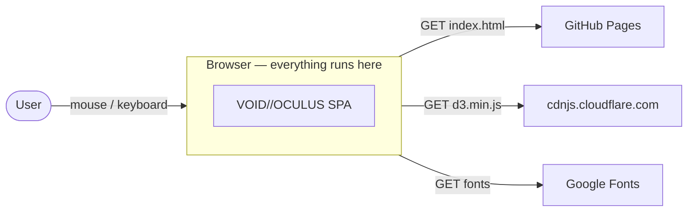
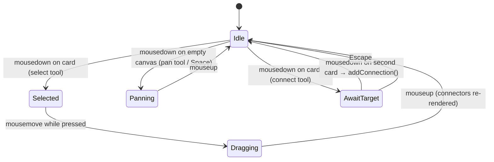
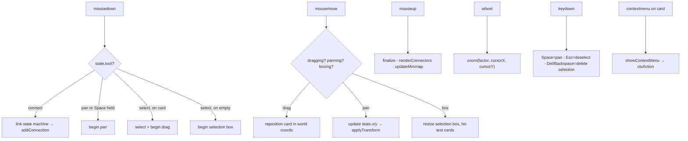

# Architecture

This page describes how VOID//OCULUS is structured internally: rendering layers, state, coordinate systems, event flow, the ocular engine, and the performance model. For the *why* behind these choices, see [Design Decisions](Design-Decisions). For function-level detail, see the [API Reference](API-Reference).

**Source of truth:** everything on this page is implemented in `index.html`. Function names cited here (`zoom()`, `renderConnectors()`, `iris()`, …) can be located with a plain-text search.

---

## System Context



There is **no backend**. After initial asset loading, the application is self-contained: no XHR/fetch, no WebSocket, no storage writes.

## Module Structure

`index.html` is organized as two consecutive `<script>` blocks with distinct responsibilities:

| Module | Scope | Responsibilities |
|---|---|---|
| **Canvas Engine** | Global scope | `state`, transforms, cards, connections, selection, context menu, minimap, particles, keyboard |
| **Oculus Engine** | IIFE (`(function () { … })()`) | Procedural iris rendering, gaze tracking, blinking, macro iris, background eyes; exposes only `window.addEyeCard` |

The IIFE boundary is intentional: the ocular subsystem is decorative and self-contained, so its internals (`rng()`, `iris()`, `scanEyes()`, `gazeLoop()`, `blink()`) do not pollute the global namespace.

## Rendering Layers

Rendering is a four-layer composite, ordered back-to-front:

```
┌─────────────────────────────────────────────────────────────┐
│ Layer 3: Ocular Overlay (fixed, pointer-events: none)       │
│   eyelids · scan-lines · vignette · boot · notifications    │
├─────────────────────────────────────────────────────────────┤
│ Layer 2: Connector SVG (#connector-svg)                     │
│   bezier link paths, glow filter, non-interactive           │
├─────────────────────────────────────────────────────────────┤
│ Layer 1: Canvas (#canvas, 8000×6000 px)                     │
│   absolutely-positioned card divs, transformed via CSS      │
├─────────────────────────────────────────────────────────────┤
│ Layer 0: Particle Canvas (#particles-bg)                    │
│   ambient particles, requestAnimationFrame loop             │
└─────────────────────────────────────────────────────────────┘
```

| Layer | Technology | Why this technology |
|---|---|---|
| Particles | `<canvas>` 2D | Hundreds of moving points; immediate-mode raster is cheapest |
| Cards | DOM `<div>`s | Free hit-testing, text layout, CSS styling, accessibility surface |
| Connectors | SVG | Crisp at every zoom level; CSS-stylable; native path + filter support |
| Ocular overlay | Fixed DOM + CSS | Screen-space effects independent of canvas transform |

This heterogeneous choice is deliberate — see [ADR-003](Design-Decisions#adr-003-hybrid-rendering-dom--svg--canvas).

## State Model

All mutable application state lives in a single global object (`let state = { … }`), documented with JSDoc typedefs (`CanvasState`, `Card`, `Connection`) at the top of the canvas engine script:

```javascript
let state = {
  x: -600, y: -300,           // Pan offset (px, viewport space)
  scale: 0.72,                // Zoom factor, clamped to [0.06, 3.0]
  tool: 'select',             // 'select' | 'pan' | 'connect'
  isDragging: false,          // A card drag is in progress
  isPanning: false,           // A canvas pan is in progress
  dragCard: null,             // HTMLElement being dragged
  dragOffset: { x: 0, y: 0 }, // Pointer offset within dragged card
  selectedCards: new Set(),   // Selected card IDs
  contextCard: null,          // Context-menu target
  connecting: { active: false, from: null },  // Link-tool state machine
  connections: [],            // [{ from, to, color, id }]
  cards: [],                  // [{ id, type, x, y, w, h }]
  nextId: 0,                  // Monotonic ID counter → 'card-<n>'
  mouseX: 0, mouseY: 0,       // Last pointer position (canvas coords)
  selectionStart: null,       // Selection-box drag origin
};
```

**Invariants:**

1. `state` is the single source of truth for logical state; the DOM is a projection of it. Mutations go through named functions (`createCard`, `deleteCard`, `addConnection`, …), never ad-hoc DOM edits.
2. Card identity is the DOM `id` (`card-0`, `card-1`, …); `state.cards`, `state.connections`, and `state.selectedCards` reference cards only by this ID.
3. `deleteCard(id)` cascades: it removes the DOM node, the card record, all connections touching the card, and the selection entry, then re-renders connectors and the minimap.

### Interaction state machine



## Coordinate Systems

Two coordinate spaces matter:

| Space | Origin | Affected by pan/zoom? | Used for |
|---|---|---|---|
| **Viewport** | Top-left of the browser window | No | Mouse events, context menu, overlays |
| **Canvas (world)** | Top-left of the 8000×6000 canvas | Yes | Card positions (`style.left/top`), connections, minimap |

Conversion (implemented inline in event handlers and `setupCardInteraction()`):

```javascript
// Viewport → Canvas
const canvasX = (clientX - rect.left - state.x) / state.scale;
const canvasY = (clientY - rect.top  - state.y) / state.scale;

// Canvas → Viewport
const screenX = canvasX * state.scale + state.x + rect.left;
const screenY = canvasY * state.scale + state.y + rect.top;
```

### The transform

The whole canvas is moved with a **single CSS transform** on `#canvas` (applied by `applyTransform()`):

```css
#canvas { transform-origin: 0 0; }
```
```javascript
canvas.style.transform = `translate(${state.x}px, ${state.y}px) scale(${state.scale})`;
```

Zooming keeps the point under the cursor fixed. `zoom(factor, cx, cy)` converts the focal point to world coordinates before scaling, then re-derives the pan so that world point maps back to the same screen position:

```javascript
const wx = (px - state.x) / state.scale;   // world point under cursor
const wy = (py - state.y) / state.scale;
state.scale = clamp(state.scale * factor, 0.06, 3);
state.x = px - wx * state.scale;           // re-anchor
state.y = py - wy * state.scale;
```

## Connection Rendering

`renderConnectors()` rebuilds the `#connector-svg` contents in one pass from `state.connections`. Each link is a cubic bezier from source card center to target card center (`getCardCenter()`), with horizontally-biased control points producing an S-curve:

```javascript
const dx  = to.x - from.x;
const cx1 = from.x + dx * 0.4, cy1 = from.y;
const cx2 = from.x + dx * 0.6, cy2 = to.y;
// M from C cx1 cy1, cx2 cy2, to
```

The neon glow is an SVG filter (`feGaussianBlur` + `feMerge`) applied per path. Because the SVG lives *inside* `#canvas`, connectors inherit the pan/zoom transform for free and never need per-frame recomputation during pan — only card drags and topology changes trigger re-render.

## Ocular Engine

The decorative subsystem lives in the second script (IIFE). Key components:

| Component | Function | Behavior |
|---|---|---|
| Deterministic noise | `rng(seed)` | Seeded PRNG so every iris is reproducible from its `seed` |
| Iris generator | `iris(opt)` | Returns SVG markup: sclera + veins, radial stroma fibers, crypts, pupil + highlight, limbal ring |
| Eye registry | `scanEyes(root, wx, wy)` | Discovers eye elements, registers globe position + blink schedule |
| Gaze loop | `gazeLoop()` | ~30 fps RAF loop; rotates pupils toward the pointer; culls off-screen eyes |
| Blinking | `blink(e, hold)` | Per-eye randomized blinks (2.6–13.6 s) plus a synchronized cascade every ~40 s |
| Macro iris | `buildMacroIris()` | Giant decorative iris (center `MX=1560, MY=1480`, radius `MR=2450`) visible when zoomed out |
| Dilation | `ocularTick()` | Pupil dilation reacts to zoom level; reported in the status bar (`DILATION %`) |

## Event Flow



Keyboard handling guards deletion with `document.activeElement === document.body` so typing in inputs (e.g., the search field) never deletes cards.

## Performance Model

| Concern | Mitigation | Where |
|---|---|---|
| Pan/zoom cost | Single composited CSS transform; no per-card updates | `applyTransform()` |
| Card rendering | `will-change: transform` promotes cards to GPU layers | CSS |
| Connector churn | Full SVG rebuild only on topology/drag changes, batched as one operation | `renderConnectors()` |
| Gaze animation | RAF loop throttled to ~30 fps; off-screen eyes skipped | `gazeLoop()` |
| Particles | Raster canvas + `requestAnimationFrame`; capped particle count | `initParticles()`, `animParticles()` |
| Minimap | Redrawn on transform changes + a 1 s `setInterval` safety refresh | `updateMinimap()` |
| Memory | No persistence layer; state garbage-collects with the page | by design |

**Known scaling ceiling:** cards are live DOM nodes; several hundred cards remain smooth, but thousands would require virtualization or a WebGL card layer (tracked in the [roadmap](Project-Overview#roadmap)).

---

**See also:** [Design Decisions](Design-Decisions) · [API Reference](API-Reference) · [Configuration](Configuration) · [Glossary](Glossary)
