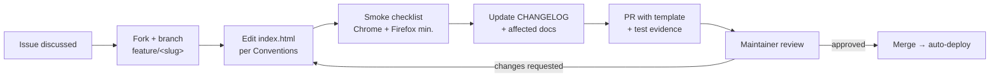

# Contributing

How to contribute to VOID//OCULUS — bugs, features, docs, and code. This page is the process view; the style rules are in [Conventions](Conventions) and the day-to-day mechanics in [Development Workflow](Development-Workflow). The canonical process document is the repository's [`CONTRIBUTING.md`](https://github.com/zazieproductions/void-oculus/blob/main/CONTRIBUTING.md); participation implies the [Code of Conduct](https://github.com/zazieproductions/void-oculus/blob/main/CODE_OF_CONDUCT.md).

---

## Ways to Contribute

| Contribution | Where | Effort |
|---|---|---|
| Report a bug | [Bug report template](https://github.com/zazieproductions/void-oculus/issues/new/choose) | Minutes |
| Request a feature | [Feature request template](https://github.com/zazieproductions/void-oculus/issues/new/choose) | Minutes |
| Improve docs | PR against repo `.md` files, or edit this wiki | Small |
| Fix a bug / build a feature | PR against `index.html` | Varies |
| Ask / answer questions | [GitHub Discussions](https://github.com/zazieproductions/void-oculus/discussions) | — |

Good first contributions: items in [Known Limitations](Troubleshooting#known-limitations) (search filtering, in-place editing, keyboard shortcuts) and the [test automation plan](Testing#future-automation).

## Before You Code

1. **Search existing issues** — avoid duplicates; add context to an existing thread instead.
2. **For non-trivial changes, open an issue first** and get maintainer alignment on the approach. This matters more than usual here: several plausible "improvements" (adding a bundler, a framework, splitting the file) contradict accepted ADRs — read [Design Decisions](Design-Decisions) before proposing structural changes.
3. **Reproduce on latest `main`** — the live site deploys from `main`, so it's always current.

## Bug Reports

A actionable report contains:

- Clear, descriptive title
- Browser + version, OS
- Steps to reproduce from a fresh page load
- Expected vs. actual behavior
- Console output (text preferred) and screenshots/recordings where visual
- Status-bar readings (zoom %, card/link/eye counts) when performance-related

## Feature Requests

Describe the **problem**, not just the solution; include concrete use cases. Check the [roadmap](Project-Overview#roadmap) and non-goals first — requests that conflict with [ADR-001](Design-Decisions#adr-001-single-file-zero-build-architecture)/[ADR-002](Design-Decisions#adr-002-vanilla-javascript-no-framework) (build tooling, frameworks) need an exceptional justification.

## Pull Request Process

1. **Fork** and branch: `git checkout -b feature/your-feature-name`
2. **Make the change**, honoring the [hard rules](#hard-rules) below.
3. **Test** against the [smoke checklist](Testing#smoke-checklist) — Chrome and Firefox at minimum, full [matrix](Testing#browser-matrix) for risky changes. Record what you tested in the PR.
4. **Update docs in the same PR**: `CHANGELOG.md` under `[Unreleased]`; `API.md` + wiki [API Reference](API-Reference) for new public functions; any wiki page your change invalidates.
5. **Commit** per the [message convention](Conventions#commit-messages): `Add: feature description`.
6. **Open the PR** using `.github/PULL_REQUEST_TEMPLATE.md`. Link the issue (`Fixes #NN`).
7. **Review**: expect at least one maintainer pass focused on state invariants, coordinate math, theming discipline, and scope. Merging deploys to production immediately ([ADR-008](Design-Decisions#adr-008-github-pages-via-actions-as-the-reference-deployment)).

## Hard Rules

Non-negotiables that will block a PR:

1. **Single-file architecture stays.** All HTML/CSS/JS in `index.html` ([ADR-001](Design-Decisions#adr-001-single-file-zero-build-architecture)).
2. **No new dependencies** beyond D3.js and Google Fonts without a superseding ADR ([ADR-004](Design-Decisions#adr-004-d3js-from-a-pinned-cdn-used-narrowly)).
3. **No frameworks, no build tools** ([ADR-002](Design-Decisions#adr-002-vanilla-javascript-no-framework)).
4. **State discipline**: mutate `state` only through named functions; the DOM remains a projection ([Architecture § State Model](Architecture#state-model)).
5. **Theme via CSS variables**; no hard-coded colors in components.
6. **JSDoc on public functions**; new user-facing strings that reach `innerHTML` must respect [Security § XSS Considerations](Security#xss-considerations).
7. **Docs travel with code** — a PR that changes behavior without updating the changelog and affected docs is incomplete.

## Documentation Contributions

- Repository `.md` files: normal PR flow.
- Wiki pages: follow [Conventions § Documentation Standards](Conventions#documentation-standards) — one concept per page, cross-link on first mention, keep the [Glossary](Glossary) authoritative for terms.
- Fixing a discrepancy between docs and code? The **code is the source of truth**; cite the function name in your edit.

## Review SLAs & Communication

- Issues and PRs are triaged on a best-effort basis; ping via a comment after ~a week of silence.
- Questions → [Discussions](https://github.com/zazieproductions/void-oculus/discussions); security issues → [private advisories only](Security#reporting-a-vulnerability), never public issues.

---

*All contributions are appreciated. Together, we build the canvas.*

**See also:** [Development Workflow](Development-Workflow) · [Conventions](Conventions) · [Testing](Testing)
