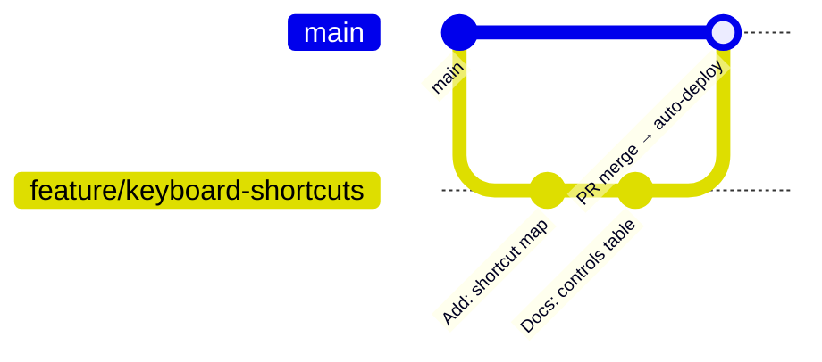

# Development Workflow

The end-to-end process for making a change: environment, branching, editing the single-file app, testing, review, and release. Style rules live in [Conventions](Conventions); process for external contributors in [Contributing](Contributing).

---

## Environment Setup

```bash
git clone https://github.com/zazieproductions/void-oculus.git
cd void-oculus
python3 -m http.server 8000   # or: npx serve .
```

Open <http://localhost:8000>. That's the entire toolchain — no install, no build ([ADR-001](Design-Decisions#adr-001-single-file-zero-build-architecture)).

**Editor tips for a 3,200-line single file:**

- Navigate by the banner comments (`// ====== CANVAS STATE ======`, `// ====== TRANSFORM ======`, …) — see [Conventions § File Organization](Conventions#file-organization).
- Use symbol navigation (`Ctrl/Cmd+Shift+O` in VS Code) — every public function is top-level and named.
- Fold the `<style>` block when working on JS, and vice versa.

## Branching Model



| Rule | Rationale |
|---|---|
| `main` is protected in spirit: changes land via PR | **Every merge to `main` deploys to production** ([ADR-008](Design-Decisions#adr-008-github-pages-via-actions-as-the-reference-deployment)) |
| Branch names: `feature/<slug>`, `fix/<slug>`, `docs/<slug>` | Discoverability in `git branch` output |
| One logical change per PR | The single-file layout makes mixed diffs hard to review |
| Rebase or squash-merge preferred | Linear history keeps `git bisect` useful on one file |

## Change Lifecycle

1. **Open an issue first** for anything non-trivial (bug report or feature request template in `.github/ISSUE_TEMPLATE/`). Align on approach before writing code.
2. **Branch** from up-to-date `main`.
3. **Edit `index.html`.** Respect the section you're in; keep the [state invariants](Architecture#state-model) intact (all mutations through named functions; DOM is a projection of `state`).
4. **Self-test** against the [smoke checklist](Testing#smoke-checklist) in at least Chrome + Firefox; full matrix before release.
5. **Update documentation in the same PR**: `CHANGELOG.md` (Keep a Changelog format, under `[Unreleased]`), plus any repo doc or wiki page your change invalidates.
6. **Commit** using the [commit convention](Conventions#commit-messages).
7. **Open a PR** using the template; fill in the test evidence section (browsers exercised, console clean).
8. **Review** — at least one maintainer approval. Reviewers check: state invariants, coordinate math correctness, theme-variable usage, no new globals, no framework/tool creep.
9. **Merge** → GitHub Actions deploys to Pages automatically. **Verify the live site** within a few minutes of merging.

## Definition of Done

A change is done when **all** of the following hold:

- [ ] Behavior verified against the [smoke checklist](Testing#smoke-checklist); console free of errors
- [ ] No regression in pan/zoom/drag coordinate math at extreme zoom (0.06 and 3.0)
- [ ] All colors reference theme variables; no hard-coded hex in components
- [ ] Public functions carry JSDoc ([Conventions § JavaScript](Conventions#javascript))
- [ ] `CHANGELOG.md` updated under `[Unreleased]`
- [ ] Affected docs updated (`API.md` for new public functions; wiki pages that describe the touched behavior)
- [ ] PR template completed with test evidence

## Debugging Techniques

The app exposes its full API on the console — use it:

```javascript
// Inspect live state
state                          // full state object
state.cards.length             // card count
state.connections              // link topology

// Drive the app programmatically
setTool('connect');
addConnection('card-1', 'card-2', '#ff0000');
zoom(2, innerWidth / 2, innerHeight / 2);
resetView();

// Reproduce coordinate bugs deterministically
state.x = -600; state.y = -300; state.scale = 0.72; applyTransform();
```

**Common pitfalls when debugging:**

- If cards "jump" during drag, the bug is almost always in viewport↔world conversion — check `state.scale` handling first ([Architecture § Coordinate Systems](Architecture#coordinate-systems)).
- Connectors not updating? `renderConnectors()` runs on topology change and drag end, not continuously — call it manually after console mutations.
- The minimap self-heals every second (`setInterval(updateMinimap, 1000)`); don't mistake that for event-driven correctness.

## Release Process

1. Ensure `[Unreleased]` in `CHANGELOG.md` is complete and accurate.
2. Move entries to a new version heading following [SemVer](https://semver.org/): breaking UX/API changes → major; features → minor; fixes → patch.
3. Tag: `git tag -a v1.1.0 -m "v1.1.0" && git push --tags`.
4. Create a GitHub Release from the tag; paste the changelog section.
5. Deployment is already live (it happened at merge); the release is a bookkeeping/announcement step.

## Dependency Management

- **Runtime deps** (D3, fonts) are pinned in `index.html` `<head>`. Upgrading D3 is a deliberate PR: bump the version in the URL, run the full [test matrix](Testing#browser-matrix), and note it in the changelog.
- **CI deps** (GitHub Actions) are watched by Dependabot weekly (`.github/dependabot.yml`); review and merge those PRs promptly — they gate the deploy pipeline.

---

**See also:** [Conventions](Conventions) · [Testing](Testing) · [Contributing](Contributing) · [Deployment](Deployment)
